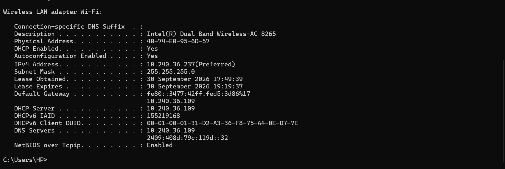
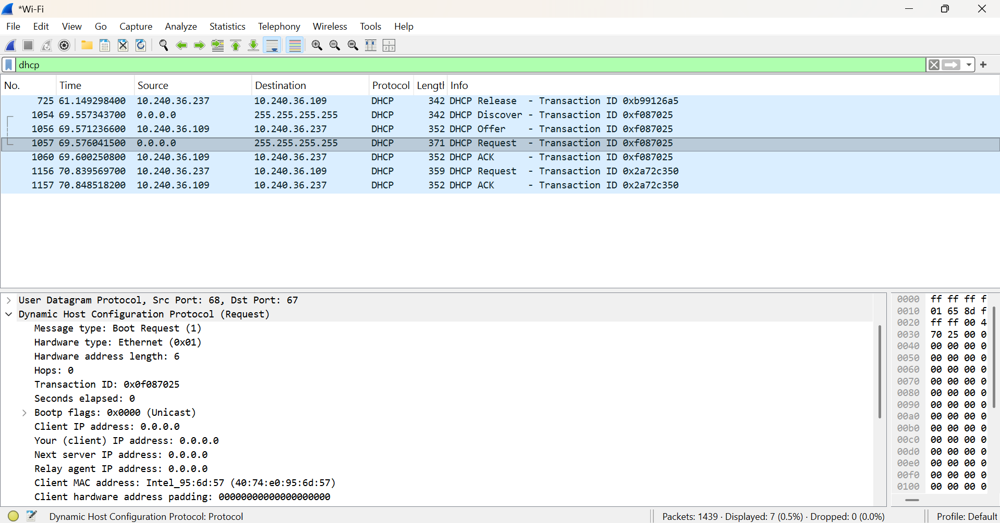

# 🔵 Day 06 — DHCP & IP Address Assignment

## 🎯 Objective

Understand how DHCP automatically assigns network configuration and learn how SOC analysts can correlate an IP address with a device during an investigation.

---

## 📚 Concepts Learned

### 1. What is DHCP?

**DHCP (Dynamic Host Configuration Protocol)** automatically provides network configuration to a device.

DHCP can provide:

- IP Address
- Subnet Mask
- Default Gateway
- DNS Server

From a SOC perspective, DHCP is important because a private IP address can be dynamically assigned to different devices at different times.

---

## 2. DHCP DORA Process

DHCP commonly uses the **DORA** process:

```text
Discover → Offer → Request → Acknowledgment
````

| Step           | Meaning                                   |
| -------------- | ----------------------------------------- |
| Discover       | Client searches for a DHCP server         |
| Offer          | DHCP server offers an IP configuration    |
| Request        | Client requests the offered configuration |
| Acknowledgment | DHCP server confirms the assignment       |

---

## 3. DHCP Ports

| Device      | UDP Port |
| ----------- | -------: |
| DHCP Server |       67 |
| DHCP Client |       68 |

Typical communication:

```text
Client → Server : UDP 68 → 67
Server → Client : UDP 67 → 68
```

---

# 🧪 Practical 1 — Windows `ipconfig /all`

Command used:

```cmd
ipconfig /all
```

### Network Configuration Observed

| Parameter       | Observed Value  |
| --------------- | --------------- |
| IPv4 Address    | `10.240.36.237` |
| Subnet Mask     | `255.255.255.0` |
| Default Gateway | `10.240.36.109` |
| DHCP Enabled    | Yes             |
| DHCP Server     | `10.240.36.109` |
| DNS Server      | `10.240.36.109` |

### Observation

The system is using DHCP to obtain its network configuration.

The same IP address `10.240.36.109` is configured as the default gateway, DHCP server, and DNS server for this client.

> The IP values alone do not prove whether these services are running on one physical device, but they show that the same network endpoint is configured for all three roles.

### Evidence



---

# 🧪 Practical 2 — DHCP Packet Analysis with Wireshark

### Wireshark Filter

```text
dhcp
```

The capture showed DHCP traffic including:

```text
DHCP Release
DHCP Discover
DHCP Offer
DHCP Request
DHCP ACK
```

This provided packet-level evidence of the DHCP address assignment process.

---

## 🔎 DHCP Discover

Observed communication:

```text
Source      : 0.0.0.0
Destination : 255.255.255.255
```

The client initially does not have a usable IPv4 address, so the DHCP Discover is sent as a broadcast.

---

## 🔎 DHCP Offer

Observed:

```text
Source      : 10.240.36.109
Destination : 10.240.36.237
```

The DHCP server offers network configuration to the client.

---

## 🔎 DHCP Request

Observed:

```text
Source      : 0.0.0.0
Destination : 255.255.255.255
UDP         : 68 → 67
```

The selected packet showed:

```text
Message Type       : Boot Request
Client IP Address  : 0.0.0.0
Client MAC Address : 40:74:e0:95:6d:57
Source Port        : 68
Destination Port   : 67
```

---

## 🔎 DHCP ACK

Observed:

```text
Source      : 10.240.36.109
Destination : 10.240.36.237
UDP         : 67 → 68
```

The DHCP ACK confirms the server's response to the client's request.

### DORA observed in the capture

```text
Discover
   ↓
Offer
   ↓
Request
   ↓
ACK
```

### Evidence



---

# 🛡️ SOC Investigation Scenario

### Alert

Suppose a SOC alert reports:

```text
Source IP      : 10.240.36.237
Destination IP : 185.220.101.45
Destination Port: 443
Time           : 14:32
```

The source IP is a private address.

A SOC analyst should not immediately conclude that the device is compromised.

The first important question is:

> **Which device was using this IP address at the exact time of the alert?**

### Investigation Workflow

```text
Suspicious IP
     ↓
Exact Timestamp
     ↓
DHCP Lease Records
     ↓
MAC Address
     ↓
Hostname / Asset
     ↓
User / Device
     ↓
Endpoint Activity
     ↓
Process / Network Activity
     ↓
Conclusion
```

### Evidence to investigate

* DHCP lease information
* MAC address
* Hostname
* Asset information
* User associated with the device
* Process responsible for the connection
* DNS activity
* Other network connections
* Endpoint activity around the alert time
* Threat intelligence for the destination IP/domain

---

# 🧠 SOC Investigation Mindset

A private IP address alone does not identify a specific physical device forever.

Because DHCP can dynamically assign addresses, an analyst should correlate:

```text
IP Address
    +
Exact Timestamp
    ↓
DHCP Lease
    ↓
MAC Address
    ↓
Hostname / Device
    ↓
User
```

This helps establish **which device was using the IP at the time of the event**.

---

# 🔍 Wireshark Filter Practiced

```text
dhcp
```

Alternative filter if DHCP packets are displayed as BOOTP:

```text
bootp
```

---

# 🎯 Interview Questions

### Q1. What is DHCP?

DHCP stands for **Dynamic Host Configuration Protocol**. It automatically provides network configuration such as IP address, subnet mask, gateway, and DNS server.

### Q2. What is DORA?

DORA stands for:

```text
Discover
Offer
Request
Acknowledgment
```

It describes the common DHCP address assignment process.

### Q3. Which ports does DHCP use?

```text
UDP 67 → DHCP Server
UDP 68 → DHCP Client
```

### Q4. Why is DHCP important in SOC investigations?

DHCP helps correlate a private IP address with the device that was using that IP at a specific time.

### Q5. Can the same IP address belong to different devices?

Yes. With dynamic addressing, an IP address can be assigned to different devices at different times.

Therefore, an analyst should use the **IP + timestamp + DHCP lease information** rather than relying only on the IP address.

---

# 🛡️ SOC Relevance

This practical helped me understand how DHCP information can support:

* IP-to-device identification
* Incident investigation
* Asset identification
* Timeline analysis
* Network activity correlation
* SOC alert triage

---

# 📝 Key Takeaways

* DHCP automatically provides network configuration.
* DHCP commonly uses UDP ports **67 and 68**.
* DORA = **Discover → Offer → Request → ACK**.
* DHCP traffic can be identified in Wireshark using `dhcp`.
* A private IP does not permanently identify one device.
* IP address + exact timestamp + DHCP lease can help identify the device involved in an alert.
* DHCP information can be useful during SOC investigations.

---

### Evidence 1

`01-ipconfig-dhcp-details.png`

Shows the Windows DHCP/network configuration.

### Evidence 2

`02-wireshark-dhcp-analysis.png`

Shows DHCP Discover, Offer, Request, and ACK packets with UDP 67/68 communication.

---

# ✅ Day 06 Status

| Area                    | Status      |
| ----------------------- | ----------- |
| DHCP Fundamentals       | ✅ Completed |
| DHCP Ports              | ✅ Completed |
| DORA Process            | ✅ Completed |
| `ipconfig /all`         | ✅ Completed |
| Wireshark DHCP Analysis | ✅ Completed |
| DHCP SOC Investigation  | ✅ Completed |
| Interview Preparation   | ✅ Completed |
| Practical Evidence      | ✅ Completed |

---

## ⚡ Quick Revision

```text
DHCP
↓
Automatically provides network configuration

DORA
↓
Discover → Offer → Request → ACK

Ports
↓
Server = UDP 67
Client = UDP 68

SOC
↓
IP + Timestamp
      ↓
DHCP Lease
      ↓
MAC
      ↓
Hostname / Device
      ↓
User
      ↓
Investigation

