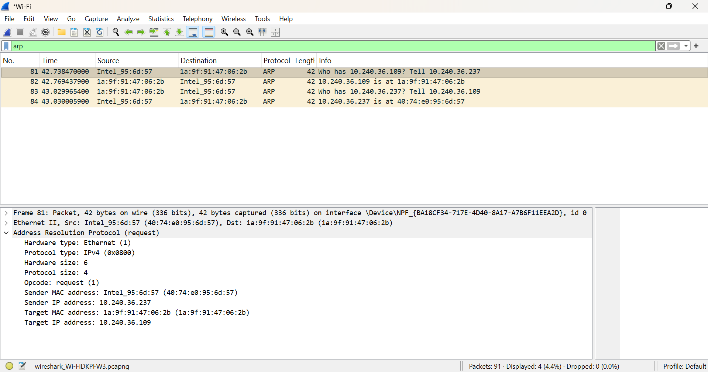

# Day 07 — ARP & MAC Address Resolution

## 🎯 Objective

Understand how ARP resolves an IPv4 address to a MAC address on a local network and how ARP information can support SOC investigations.

---

## 🧠 Core Concepts

### What is ARP?

**ARP (Address Resolution Protocol)** resolves an IPv4 address to a MAC address on the local network.

Example:

```text
10.240.36.109 → 1a:9f:91:47:06:2b
```

### ARP Request vs Reply

```text
ARP Request → "Who has this IP? Tell me your MAC."
ARP Reply   → "This IP is at my MAC."
```

- ARP Request is normally broadcast.
- ARP Reply is normally unicast.
- ARP works on the local network.

### Local vs Remote

```text
Same subnet:
Host → ARP → Destination MAC

Remote network:
Host → ARP → Gateway MAC → Gateway → Remote Network
```

---

# 🔬 Practical Analysis

## Q1–Q4: ARP Table

From `arp -a`:

| Question | Answer |
|---|---|
| **Q1. What is your gateway IP?** | `10.240.36.109` |
| **Q2. What MAC address is associated with your gateway?** | `1a-9f-91-47-06-2b` |
| **Q3. Is the entry dynamic or static?** | `Dynamic` |
| **Q4. What does the ARP table tell you?** | It shows known IPv4-to-MAC address mappings. |

> The ARP table is not a general record of all network communication.

---

## Q5: What happens when you ping the gateway?

The IP packet is carried inside a local link-layer frame.

```text
IP Packet
   ↓
Link-Layer Frame
   ↓
Source MAC + Destination MAC
```

The IP addresses identify the endpoints, while MAC addresses are used for local delivery.

---

# 📡 Q6–Q9: Wireshark ARP Analysis

### Filter

```text
arp
```

### Q6. What is the sender IP?

```text
10.240.36.237
```

### Q7. What is the sender MAC?

```text
40:74:e0:95:6d:57
```

### Q8. What is the target IP?

```text
10.240.36.109
```

### Q9. What MAC address is resolved for the target IP?

The ARP Reply shows:

```text
10.240.36.109 is at 1a:9f:91:47:06:2b
```

Therefore:

```text
10.240.36.109
        ↓
1a:9f:91:47:06:2b
```

### Evidence



---

# 🚨 Q10–Q12: SOC Investigation — Possible ARP Spoofing

### Scenario

Normal gateway:

```text
Gateway IP:  10.240.36.109
Gateway MAC: AA:AA:AA:AA:AA:AA
```

Observed:

```text
Gateway IP:  10.240.36.109
Observed MAC: BB:BB:BB:BB:BB:BB
```

---

### Q10. What would you investigate?

I would not immediately conclude that it is an attack.

I would investigate:

- `arp -a`
- `ipconfig /all`
- Gateway IP and MAC
- Wireshark ARP packets
- Source MAC and timestamp
- DHCP information
- Whether other hosts show the same change
- Device associated with the MAC
- Other suspicious network activity

---

### Q11. What evidence would you collect?

```text
Gateway IP
Gateway MAC
Observed MAC
Timestamp
ARP Request/Reply
DHCP information
Affected device
Other affected hosts
Network configuration changes
Related network traffic
```

SOC correlation:

```text
IP → MAC → Time → Device → Network Activity
```

---

### Q12. What is ARP spoofing?

ARP spoofing occurs when forged ARP information causes a device to associate a legitimate IP address, such as the gateway IP, with an attacker's MAC address.

Example:

```text
Normal:
Gateway IP → Legitimate Gateway MAC

Possible Spoofing:
Gateway IP → Attacker MAC
```

This can potentially position the attacker between the victim and gateway, enabling MITM/interception or traffic manipulation depending on network protections.

> **Important:** An unexpected ARP mapping is a suspicious indicator, not automatic proof of an attack.

---

# 🎤 Q13–Q18: Interview Questions

### Q13. What is ARP?

ARP stands for **Address Resolution Protocol**. It resolves an IPv4 address to a MAC address on the local network.

### Q14. What is the difference between IP and MAC?

- **IP:** Logical network-layer address.
- **MAC:** Link-layer address associated with a network interface.

### Q15. What does an ARP Request ask?

> "Who has this IPv4 address? Tell me your MAC address."

### Q16. Why is an ARP Request normally broadcast?

Because the sender knows the target IP but does not yet know which MAC address owns it. Therefore, the request is broadcast on the local network.

### Q17. Your machine is `10.65.57.237/24` and destination is `10.65.57.100`. Which MAC is required?

**Answer:** Destination `10.65.57.100` MAC.

Both addresses belong to the same `/24` subnet:

```text
10.65.57.0/24
```

### Q18. Your machine is `10.65.57.237/24` and destination is `8.8.8.8`. Which MAC is required?

**Answer:** The MAC address of the default gateway `10.65.57.87`.

Because `8.8.8.8` is on a remote network, the host sends the frame to the gateway.

---

# 🛡️ SOC Relevance

ARP analysis can help investigate:

- ARP spoofing
- MITM activity
- Unexpected gateway MAC changes
- Suspicious local-network behavior
- IP → MAC → device correlation
- DHCP + ARP investigation

### SOC Investigation Mindset

```text
WHO?
WHAT?
WHEN?
WHY?
HOW?
EVIDENCE
CONCLUSION
```

**Unusual ≠ automatically malicious.**

Always correlate network evidence before reaching a conclusion.

---

# 🔑 Key Takeaways

- ARP resolves **IPv4 → MAC**
- ARP works on the **local network**
- Request = **Who has this IP?**
- Reply = **This IP is at my MAC**
- Request is normally **broadcast**
- Reply is normally **unicast**
- Same subnet → ARP for **destination MAC**
- Remote destination → ARP for **gateway MAC**
- Unexpected MAC change ≠ automatically malicious
- SOC investigations require **evidence and correlation**

---

## ✅ Day 07 Status

**Completed**

### Skills Demonstrated

- ARP fundamentals
- IP vs MAC
- ARP Request/Reply analysis
- Wireshark ARP filtering
- Gateway MAC resolution
- Local vs remote network reasoning
- Basic ARP spoofing investigation
- Evidence-based SOC investigation
